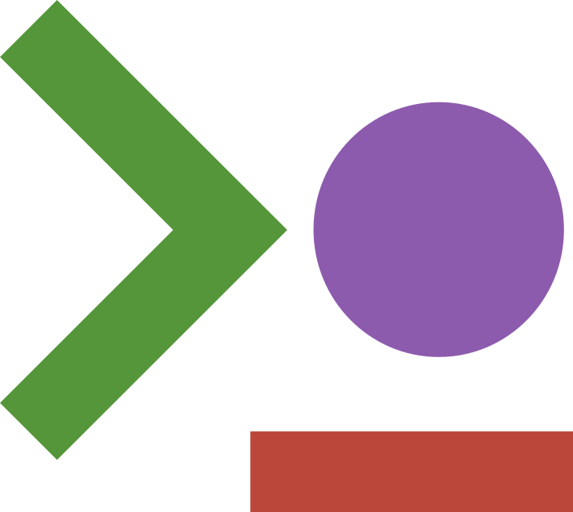

#  TPlot.jl

`TPlot` is a quite a personalized mini-package for my personal use. I run a lot of simulations through the JuliaREPL and was not satisfied with real-time rendering and terminal plotting aesthetics are on the rise now... so well... `TPlot` depends only on Julia's `Printf` stdlib. It supports Julia 1.10 and later.

## Install locally

```julia
using Pkg
Pkg.develop(path="/path/to/scientific-stack/TPlot.jl")
```

# Usage

API is nothing crazy, the main object are panels and scenes.

## Scenes and tiling

A scene is a tiling of panel

```julia
using TPlot

scene = Row(
    PANEL A,
    Column(
        PANEL B.1,
        PANEL B.2),
    weights=(1, 1))

render(scene;)
```

`PANEL A` receives half the available width. The two `PANEL B` split the other half vertically. 
`Row` divides width. `Column` divides height. Both accept nested panels or layouts, positive `weights`.

Every `render` reads `displaysize(io)` again. An explicit `size=(rows, columns)` overrides terminal detection. No resize listener or mutable scene lifecycle is required.

```julia
render(scene; io=stdout, size=(30, 100))
render(scene; io=IOBuffer(), size=(12, 50))
```

Panels retain references to their data ! Modify those arrays in place and render the same tree again ! Grow a time vector and its curve vectors together. Replace a panel when you replace its data arrays. See the [examples/tiles.jl](examples/tiles.jl) animated example:


## Panels-types 

The two main panels we have here are based on my current usage

- To plot implicitly defined domain via levelsets we have the `Geometry` panel:  `Geometry(phi; field=nothing, colorrange=nothing, title="φ ≤ 0", cell_aspect=2.0)` displays the region `phi ≤ 0` and fields can be nodal vectors in the same ordering or matrices with the same shape. Non-finite field values do not contribute to color averages or automatic limits. A field must contain at least one finite value. Mask exterior values with `NaN` if they should not affect automatic color limits..
- To plot time-series data or anything related we have the `Curves`panel:  `Curves(t, y; xrange=nothing, yrange=nothing, labels=nothing, ylabel=nothing, title=nothing)`.  `y` can be a vector, a vector of vectors, or a matrix with one series per column. Every series must match the length of `t`. Non-finite samples break a trace. Fixed ranges prevent automatic limits from changing between frames..


Layout frames stay within the requested cell dimensions. Small tiles clip content instead of expanding the terminal. Titles and legends use terminal display widths, including wide Unicode characters.

## License

MIT. [LICENSE](LICENSE).
